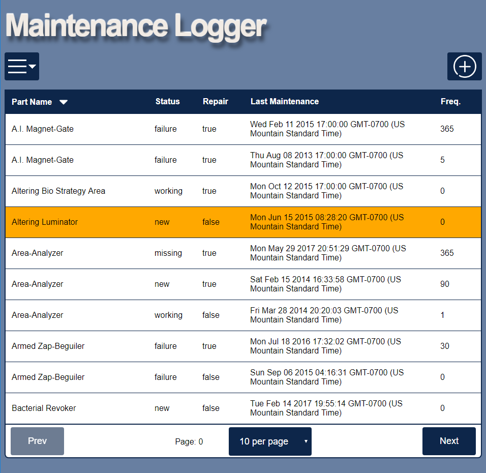

# Maintenance Logger

[Thinkful](https://www.thinkful.com/) second capstone project.

## Introduction
A MEAN stack app where user can track repair and status on equipment.  Users can use the tool help efficiency with maintenance work by increasing communication between maintainers.  Records (part name, status, etc.), can be added, updated, sorted, or deleted.  The user can filter the results based on fields in the maintenance record to return a list of records.

## Summary
Maintenance Logger allows the user to input, retrieve, modify and delete maintenance records.  The user can sort by any field in the database, and setup queries to narrow down records.

## Technical
* The frontend is built using HTML5, CSS, Javascript, JQuery, and AJAX.  The backend uses Node, Express and MongoDB.
* The app is fully responsive, adapting for mobile, table and desktop viewports.
* A test suite has been implemented to ensure that the API still works as expected after each integration of a new feature.

## To work on the project locally:
1. Download or clone the repository.
2. Install [node](http://nodejs.org/).
3. Install [mongo](http://www.mongodb.com/).
4. run `npm install` 
5. `npm run mongodb` to start Mongo database
6. `npm start` to start the app
7. The website should be available at the following address: http://127.0.0.1:8080/