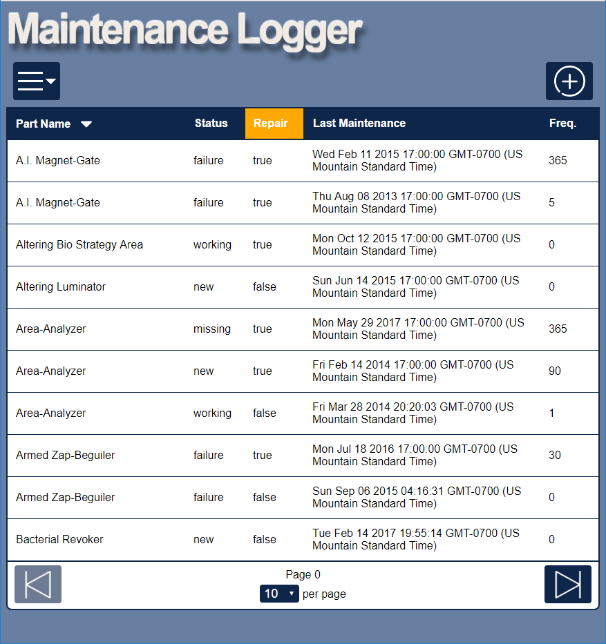

#Maintenance Logger
Thinkful - Capstone Project -  A responsive app that uses Node and Express to create a backend that acts as a REST API.  Mongoose is the database being used to store the maintenance records. 

##Summary
Maintenance Logger allows the user to input, retrieve, modify and delete maintenance records.  The user can sort by any field in the database, and setup queries to narrow down records.

##Technical
* The app is built using HTML, CSS, JavaScript, jQuery, Node, Express, and Mongoose.
* The app is fully responsive, adapting for mobile, table and desktop viewports.